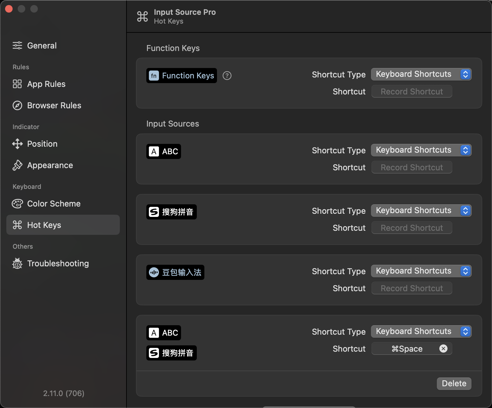

# DoubaoVoiceRestore

**Let Doubao IME handle voice input without taking over your keyboard.**

[](https://github.com/yangwudong/doubao-voice-ime-restore/actions/workflows/ci.yml)
[](https://github.com/yangwudong/doubao-voice-ime-restore/releases)
[](LICENSE)


中文: [README.md](README.md)

## The problem

Doubao IME (豆包输入法) has a genuinely useful global voice-input hotkey: hold right `⌥` in any text field, speak, and your words are transcribed at the cursor.

It comes with an infuriating side effect. **To run the transcription, macOS has to make Doubao the active input source — and Doubao leaves it that way.** The voice window closes, but you are still "in" Doubao. You find out when you type the next character in the wrong input method, and you switch back by hand. Every single time.

What I want is simple:

> **Doubao should do voice input and nothing else. When the voice window closes, the input method I actually type with should still be selected.**

Qwen IME (通义千问输入法) already behaves this way. Doubao does not. `DoubaoVoiceRestore` is a ~300-line background agent that fixes exactly that.

## Before and after

| Step | Without this tool | With this tool |
| --- | --- | --- |
| Hold the voice hotkey | switches to Doubao | switches to Doubao |
| Speak, text is inserted | works | works |
| Voice window closes | **still on Doubao** | back to your input method after ~0.3 s |
| Keep typing | wrong input method, fix by hand | the one you chose |

## How it works

Three read-only observations and one public API call. Doubao is never touched.

| Step | System API | Notes |
| --- | --- | --- |
| 1. Remember your input source | `kTISNotifySelectedKeyboardInputSourceChanged` | When the active source becomes Doubao, record what was active just before |
| 2. Detect the session start | `CGWindowListCopyWindowInfo` | Look for the small voice pill Doubao draws near the bottom of a display. **Window geometry only — no screen contents**, so no Screen Recording permission is needed |
| 3. Detect the session end | same | Every Doubao window disappears, then a ~0.3 s debounce |
| 4. Switch back | `TISSelectInputSource` | Public API; re-selects the source from step 1 |

`CGEventSource.secondsSinceLastEventType` is also used to ask *how many seconds ago* the last key-down happened, which distinguishes "the user pressed a key to end the session" (restore after 0.12 s) from "silence timeout". That API returns **only a time interval — never which key was pressed** — so it cannot be used to log keystrokes.

**No Doubao files are modified, no process is injected, no `sudo`.** Doubao updates cannot break the install. If a future Doubao redesign breaks the pill heuristics, the failure mode is a missed restore — i.e. the behaviour you already have today without this tool.

### Permissions required

**None.** No Accessibility, no Input Monitoring, no Screen Recording, no admin password, no network access. Everything above is unprivileged public API.

## Requirements

- macOS 11 Big Sur or later (developed and verified on macOS 15 / Apple Silicon)
- Doubao IME installed, with **Doubao settings → Voice input → global voice hotkey** enabled

## Install

### One-line install (recommended)

```sh
curl -fsSL https://raw.githubusercontent.com/yangwudong/doubao-voice-ime-restore/main/scripts/install.sh | bash
```

This downloads the latest universal binary (arm64 + x86_64) from [Releases](https://github.com/yangwudong/doubao-voice-ime-restore/releases) and installs it as a per-user LaunchAgent. **No `sudo` at any point.**

The same command upgrades an existing install: the running instance is stopped first.

<details>
<summary>Prefer to read the script before running it (recommended)</summary>

```sh
curl -fsSL https://raw.githubusercontent.com/yangwudong/doubao-voice-ime-restore/main/scripts/install.sh -o install.sh
less install.sh
bash install.sh
```

</details>

<details>
<summary>When github.com is slow or blocked</summary>

```sh
curl -fsSL https://cdn.jsdelivr.net/gh/yangwudong/doubao-voice-ime-restore@main/scripts/install.sh \
  | DVR_MIRROR=https://ghfast.top/ bash
```

</details>

Supported environment variables:

| Variable | Default | Meaning |
| --- | --- | --- |
| `DVR_VERSION` | `latest` | Install a specific tag, e.g. `v1.0.0` |
| `DVR_MIRROR` | empty | URL prefix for the GitHub download, e.g. `https://ghfast.top/` |

### Other ways

**From a downloaded archive**: unzip a release and run `bash install.sh`. The binary in the archive is used directly, with no network access.

**From source**: requires the Xcode Command Line Tools (`xcode-select --install`).

```sh
git clone https://github.com/yangwudong/doubao-voice-ime-restore.git
cd doubao-voice-ime-restore
make install
```

One `install.sh` covers all three cases: it prefers a binary next to itself, then a local Swift build, then a release download.

### What gets installed

| Path | Purpose |
| --- | --- |
| `~/Library/Application Support/DoubaoVoiceRestore/DoubaoVoiceRestore` | executable |
| `~/Library/LaunchAgents/io.github.yangwudong.doubao-voice-ime-restore.plist` | login agent |
| `~/Library/Logs/DoubaoVoiceRestore.log` | log file |

Everything stays inside your home directory.

## Verify

1. Switch to the input method you normally type with
2. Hold the Doubao voice hotkey and say something
3. Release, or press any key, to end the session
4. Check the menu bar — your input method should be back

Follow the log live:

```sh
tail -f ~/Library/Logs/DoubaoVoiceRestore.log
```

A healthy session looks like this:

```
2026-08-28 19:41:02.311 input source -> com.bytedance.inputmethod.doubaoime (state: idle)
2026-08-28 19:41:02.377 armed; will restore com.sogou.inputmethod.sogou.pinyin
2026-08-28 19:41:02.622 voice session started (pill detected)
2026-08-28 19:41:06.104 Doubao windows gone; restoring in 0.12s
2026-08-28 19:41:06.231 voice session ended; restored com.sogou.inputmethod.sogou.pinyin
```

Confirm the agent is running:

```sh
launchctl list | grep doubao-voice-ime-restore
```

## Recommended companion: keep Doubao out of your switch cycle

This tool solves one half of the problem — getting your input method back after a voice session. The other half shows up as soon as Doubao is enabled at all: **macOS's built-in `⌃Space` cycles through *every* enabled input source, so Doubao is now in your rotation and you land on it by accident.**

[Input Source Pro](https://inputsource.pro) (free and open source, GPLv3, [runjuu/InputSourcePro](https://github.com/runjuu/InputSourcePro)) solves that half:

```sh
brew install --cask input-source-pro
```

Open it, go to **Keyboard → Hot Keys** in the sidebar, and set it up like this:



1. **The group at the bottom is a hot key group**: put only the sources you actually type with in it (`ABC` + `搜狗拼音` in the screenshot) and bind one switch key to it. That key now cycles inside the group only — **Doubao is unreachable by accident**.
   > The screenshot uses `⌘Space`, which requires moving or disabling Spotlight's `⌘Space` first. Use `⌃Space` instead if you would rather leave Spotlight alone, or one of Input Source Pro's modifier gestures such as double-tap `⇧`.
2. **Leave Doubao's own row in the Input Sources list above with an empty `Record Shortcut`** — with no shortcut of its own, it can only be activated by Doubao's voice hotkey.
3. Disable the built-in cycle so the two don't fight: **System Settings → Keyboard → Keyboard Shortcuts… → Input Sources**, uncheck *Select the previous input source* and *Select next source in the Input menu*.
4. Optional: **App Rules / Browser Rules** set a default input source per app or per website (English in your terminal and IDE, Chinese in chat apps).

**Net result: Doubao can only be activated by its voice hotkey, and this agent switches you back the moment the voice window closes.**

Neither tool replaces the other. Input Source Pro's rules fire when you change app or website; a voice session does neither — the input source changes while you stay in the same text field. And if you do set a per-app default keyboard, that is the source this agent restores to, so they cooperate.

## Uninstall

```sh
curl -fsSL https://raw.githubusercontent.com/yangwudong/doubao-voice-ime-restore/main/scripts/uninstall.sh | bash
```

Or, with the files already on disk:

```sh
bash scripts/uninstall.sh   # from a source checkout
bash uninstall.sh           # from an unzipped release
```

Stops the agent and removes the LaunchAgent, the executable and the log. Doubao is left untouched.

## Tuning

Doubao publishes no "voice started / ended" notification, so the session is inferred from the pill window's size and placement. If a Doubao update throws that off, edit the constants in [`Sources/DoubaoVoiceRestore/Tuning.swift`](Sources/DoubaoVoiceRestore/Tuning.swift) and re-run `make install` — nothing else in the code hard-codes those assumptions.

| Constant | Default | Meaning |
| --- | --- | --- |
| `pillMaxWidth` / `pillMaxHeight` | 280 / 64 | Maximum size of the voice pill, in points. Raise if the pill grew |
| `pillBottomBand` | 200 | The pill must sit within this many points of the bottom of a display |
| `sessionGoneDelay` | 0.35 s | Debounce after the windows disappear. Raise if it restores too early |
| `sessionGoneDelayAfterKey` | 0.12 s | Debounce when you ended the session with a keystroke |
| `armGrace` | 3.0 s | How long to wait for the pill after Doubao is selected. On timeout the switch is treated as manual and ignored |
| `pollInterval` | 0.06 s | Window polling cadence. Polling is skipped entirely while idle, so idle CPU is ~0% |

## Troubleshooting

| Symptom | Where to look |
| --- | --- |
| Nothing happens at all | `launchctl list \| grep doubao-voice-ime-restore` to confirm it is running, then read the tail of the log |
| Log shows `no pill within 3.0s` | The pill was not recognised (Doubao redesign, or multi-display placement). Tune `pillMaxWidth` / `pillMaxHeight` / `pillBottomBand` |
| Log never shows `input source ->` | Doubao's global voice input is off, or its hotkey does not actually switch the input source |
| Restores too early, cutting off the session | Increase `sessionGoneDelay` |
| Restores too slowly | Decrease `sessionGoneDelay` |
| Doubao process not found | `pgrep -x DoubaoIme` should print a PID; if not, Doubao IME is not running |
| macOS refuses to verify the developer | Release binaries are ad-hoc signed and not notarised. `install.sh` clears the quarantine flag for you; otherwise build from source with `make install` |

## Development

```sh
make            # list all targets
make build      # release build for this Mac
make universal  # universal arm64 + x86_64 build
make run        # run in the foreground, ^C to stop
make lint       # swift-format check
make fmt        # swift-format in place
make package    # produce the release zip in dist/
make clean      # remove build output
```

Layout:

```
Sources/DoubaoVoiceRestore/
├── main.swift          CLI parsing and entry point
├── Watchdog.swift      state machine: idle → arming → session → restoring
├── SystemProbes.swift  read-only wrappers over input source / window / key-activity APIs
└── Tuning.swift        every tunable constant
```

Command line:

```
DoubaoVoiceRestore [-q|--quiet] [-h|--help] [-v|--version]
```

`--quiet` disables logging entirely; add it to `ProgramArguments` in the plist if you would rather the log file stopped growing.

## Privacy

- **No network access.** There is no networking code in the project.
- **No keystroke logging.** The only keyboard question asked is "how many seconds since the last key-down", which returns a number, not a key.
- **No screen contents.** The window API returns geometry only.
- Logs contain timestamps, input-source bundle IDs and state-machine transitions — never anything you typed.

## Acknowledgements

- [Input Source Pro](https://github.com/runjuu/InputSourcePro) by [@runjuu](https://github.com/runjuu) — the other half of a sane input-source setup, strongly recommended alongside this tool
- Qwen IME (通义千问输入法) — the reference for what "restore the input source after voice input" should feel like

## License

[MIT](LICENSE)

## Disclaimer

This is an independent third-party tool. It is not affiliated with, authorised by, or endorsed by ByteDance. "Doubao" is a ByteDance trademark, used here only to identify the software this tool works with.
